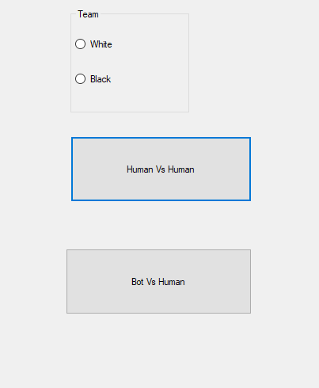
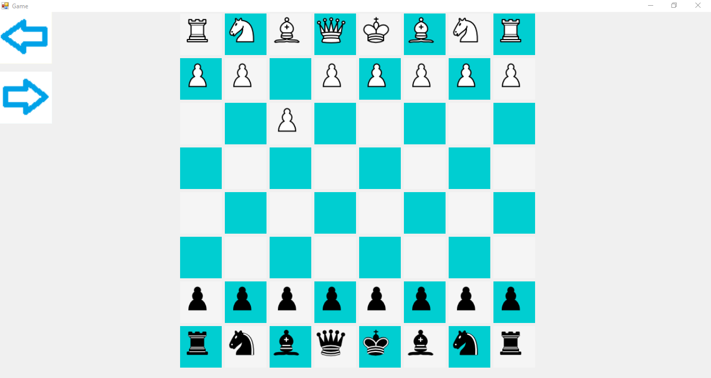
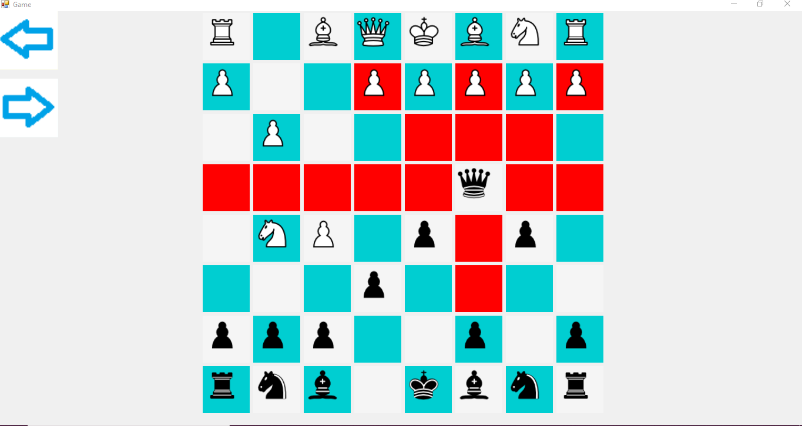

# Chess Game

- OOP concept implemented
- Unity adaptation of the project developed on .net framework has been facilitated by applying MVC design pattern.
- Algorithms have been developed that include calculating the point at which the chess pieces can move according to the situation they are in.
- Algorithms that control the game flow have been developed. (Progress, Finish and Forward-Backward)
- A simple bot was developed as a competitor. This bot randomly chooses one of the points it can go to and advances.

# Application Content

<ul>
  <li> Playing human vs human.</li>
  <li>Playing human vs bot. </li>
  <li>Shows the movable areas of the stone</li>
  <li>Move forward and backward </li>
  <li>Display by team selection.</li>
  <li>Game ending conditions. </li>
</ul>

# Team Select Screen

# Game Screens

